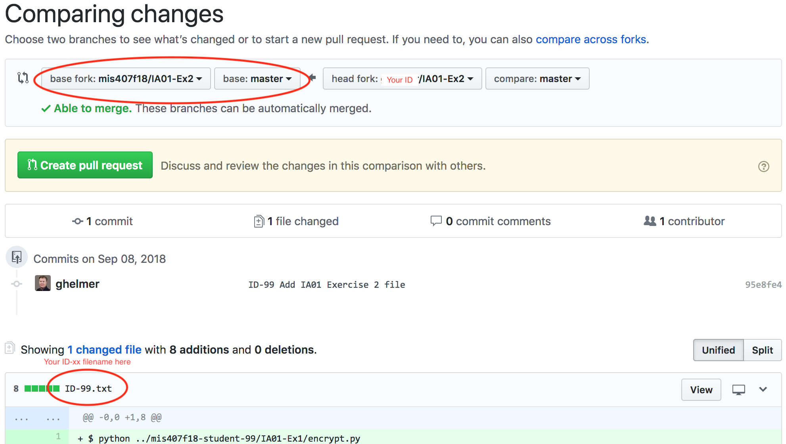

# IA01

**Due September 30 by 11:59pm.**

1. Submit the file for Exercise 1 (`transpose.py`) using a `git commit` to your **individual private repo** (`mis407f19-student-xx`) in the directory `IA01-Ex1`
1. Follow the instructions in Exercise 2 to commit a separate file using a *forked repo* and *pull request* in the **mis407f19** `IA01-Ex2` repo.

## Exercise 1 (75%): Simple word encryption

One technique used in data encryption is [transposition](https://en.wikipedia.org/wiki/Transposition_cipher). A simple example is to rearrange characters using a key of indexes, like:

| Transposition Key | `5,3,4,2,0,1` |
| ----------------- | ------------- |
| Input             | `abcdef` |
| Output            | `fdecab` |

| Transposition Key | `4,5,3,1,2,0` |
| ----------------- | ------------- |
| Input             | `fdecab` |
| Output            | `abcdef` |

Your task is to write a program that will "encrypt" strings using character transposition. Create a directory `IA01-Ex1` in your `mis407f19-student-xx` repo, and save this program in the `IA01-Ex1` directory in the file `transpose.py`.

The program must:
1. Ask for the encryption key.
   * The key must be a list of numbers between 0 and *N-1*, where *N* is the number of entries in the key's list; for example, `5,4,3,2,1,0` has six numbers, and each digit 0-5 appears in the list.
1. Asks for a line of text to encrypt.
1. Use the transposition key to transpose each chunk of *N* letters in input text.
   * If the input text is not a multiple of the key length, then pad the input with `.`. For example, if the key is `5,4,3,2,1,0` and the input is `HelloMIS!`, then add three `.` to make the input line a multiple of 6, like `HelloMIS!...`
   * Hint: You might slice batches of *N* characters out of the input string and loop over the indexes in the key to determine which characters to print out of each batch
1. Output the encrypted result.
   * If the the key is `5,4,3,2,1,0` and the input text is `HelloMIS!`, then the output should be `MolleH...!SI`
   * Or, If the key is `4,3,2,1,0` and the input text is `HelloMIS!`, then the output should be `olleH.!SIM`

For full points:
* Show an error and exit the program if the encryption key does not have the numbers 0 though *N-1* (where *N* is the number of values in the key).

An easy way to verify correct operation of the program is to use the encryption key `0`, which should give the same string in the output as in the input. Another simple test is the encryption key `1,0`, which will reverse each pair of input characters.

Examples of the program's run:

```
$ python transpose.py 
Enter key (comma-separated list of numbers)): 5,4,3,2,1,0
Enter text to encrypt: HelloMIS!
Encrypted text: MolleH...!SI

$ python transpose.py 
Enter key (comma-separated list of numbers)): 4,3,2,1,0
Enter text to encrypt: HellowMIS!
Encrypted text: olleH!SIMw

$ python transpose.py 
Enter key (comma-separated list of numbers)): 6,4,3,2,1,0
Error: key 6 is not valid (must be between 0 and 5)

$ python transpose.py 
Enter key (comma-separated list of numbers)): 4,3,2,1,0,0
Error: number 5 must be in the key

$ python transpose.py 
Enter key (comma-separated list of numbers)): 5,3,4,2,0,1
Enter text to encrypt: Our liberties we prize and our rights we will maintain.
Encrypted text: i lrOuetirbepe ws ae zrirou ndtghi rwe ws a mlilnaitin......

$ python transpose.py 
Enter key (comma-separated list of numbers)): 4,5,3,1,2,0
Enter text to encrypt: i lrOuetirbepe ws ae zrirou ndtghi rwe ws a mlilnaitin......
Encrypted text: Our liberties we prize and our rights we will maintain......
```

**Remember that the academic honesty requirements apply to this assignment: your submission must be your own work, and not copied in any way from any source!**

* NOTE: To accomplish this task, you will need to understand how to use loops, work with characters in strings, and read and process input.

# Exercise 2 (25%): Fork and Pull request

I've created a *read-only* repo called `IA01-Ex2` in https://github.com/mis407f19. Your job is to *fork* this repo in Github, make the change specified below in your forked repo, push your changes *to your fork*, and use Github to make a *pull request* -- which notifies me of your request to merge your changes to my repo. This exercise simulates the procedure you would use to contribute to any of the many public GitHub repos for other projects.

The steps you need to follow:

1. Fork the *MIS407* IA01-Ex2 repo: Go to https://github.com/mis407f19/IA01-Ex2 and click the `Fork` button in the upper right-hand corner. Follow the dialog prompts to *fork* this repo to your personal account.
1. Clone *your* IA01-Ex2 repo: In git bash, clone **your** IA01-Ex2 repo to your local computer using "git clone" -- **be sure the Github URL refers to your cloned IA01-Ex2 repo, not the original github.com/mis407f19/IA01-Ex2 repo**
1. In git bash, run the program you created in Exercise 1:
   * First, use the key `5,3,4,2,0,1` to encrypt your own phrase of at least 10 words of your choosing.
   * Second, use the key `4,5,3,1,2,0` with the output from the first run of the program to show your program can decrypt
1. Save the output from this bash session to a file in your IA01-Ex2 repo as a file named `id-xx.txt` (replacing the xx with your actual student number corresponding to your own student repository `mis407f19-student-xx`).
1. Git `add` and `commit` the file in your IA01-Ex2 repo with the message "ID-xx Add IA01 Exercise 2 file"
   * Please **do not** add/commit `transpose.py` in the IA01-Ex2 repo!
1. Git push your IA01-Ex2 repo to Github
1. Make a pull request: Browse to `https://github.com/<<your-github-id>>/IA01-Ex2`, click the **New pull request** button in the middle of the screen, and follow the prompts to create a *pull request* from *your* `IA01-Ex2` commit to the `mis407f19/IA01-Ex2` repo. A sample pull request screen shot:


Some help with pull requests:

https://help.github.com/articles/fork-a-repo/

https://help.github.com/articles/about-pull-requests/

https://help.github.com/articles/merging-a-pull-request/
