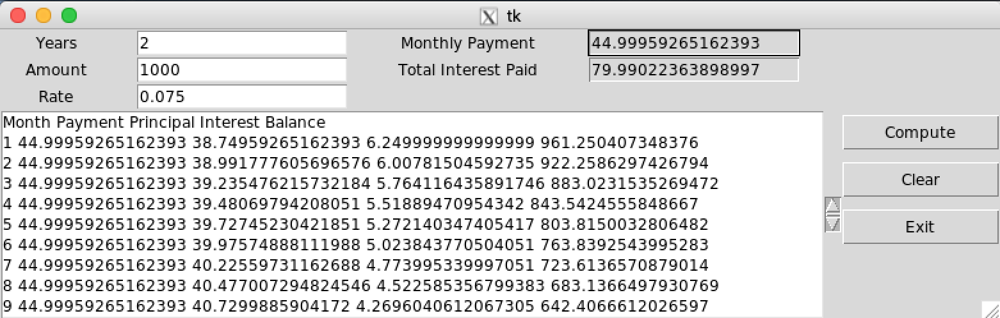

# IA04 - GUI in python

**Due November 8 11:59pm.**

**Submit this assignment via git to your individual private repo (mis407f19-student-xx) in the directory `IA04`.**

## Introduction

For this individual assignment, create a single python file called ia04.py that implements these requirements for this program that uses Tkinter for a user interface to compute a monthly payment for a loan and show the loan amortization.

Commit the program into your personal mis407f19-student-xx repository's IA04 directory.

## Compute a loan payment

Create a window using Tkinter with these text fields:

| Field | Description | Input/Output |
| -- | -- | -- |
| years | Number of years | Input |
| amount | Amount loaned | Input |
| rate | Interest rate per year | Input |
| payment | Computed monthly payment  | Output |
| total_interest | Computed total interest paid | Output |

Create a scrollable listbox to show the loan amortization for each month of payments on the loan.

Create three buttons:
* Compute
* Clear
* Exit

Here is an example of how the window could look:


Button functions:

* When the user clicks "Clear", set the years, amount, rate, payment, total_interest, and loan amortization listbox to empty strings.

* When the user clicks "Exit", destroy the main window to exit the program.

* When the user clicks "Compute":
   * Compute the monthly loan payment using this formula (you'll need to `get()` the rate, years, and amount from the window's `StringVar` variables to use in this formula):
```
monthlyrate = float(rate) / 12.0
months = int(years) * 12
payment = float(amount) * ((monthlyrate * (1 + monthlyrate) ** months) /
                              ((1 + monthlyrate) ** months - 1))
balance = float(amount)
total_interest = 0
```
   * Set the `payment` and `total_interest` GUI text fields to the values computed
   * Loop over the number of months and compute the interest, payment, and balance for the month:
       * interest = the balance times monthlyrate
       * principal = the payment minus interest
       * balance = balance minus principal
       * total_interest += interest
       * Add a line to the listbox showing the month number, payment, principal, interest, and balance
