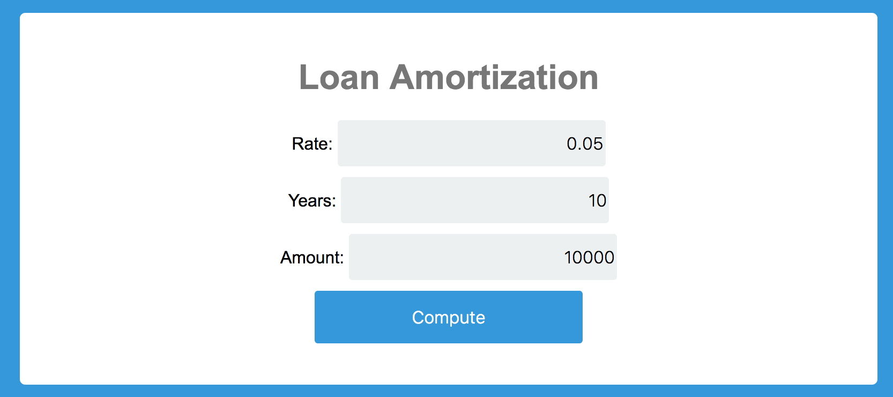
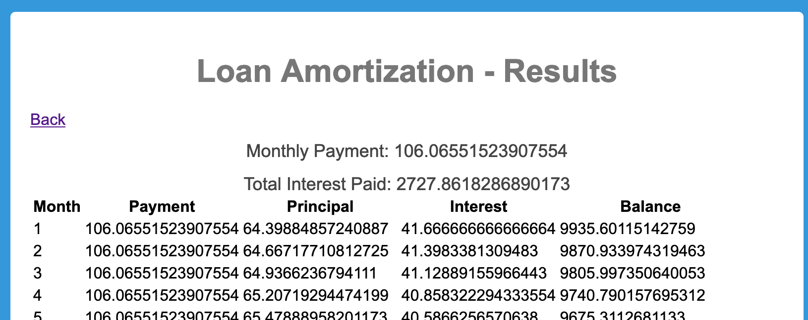

# IA05 - Website UI

**Due Nov 22 11:59pm.**

**Submit this assignment via git to your individual private repo (mis407f19-student-xx) in the directory `IA05`.**

## Introduction

For this individual assignment, create a Flask web service named `ia05.py` that listens on `0.0.0.0:8080` and implements these requirements. Also in the `IA05` directory, commit the `templates` directory containing the template HTML pages and the `static` directory containing the static files (such as the CSS file) used by your program.

See the `website` directory in this assignment for starting points for the program, templates, and css files.

## Compute a loan payment

Finish a website that computes loan amortization using a web form that takes these inputs and uses a "Submit" button that sends the fields to the web service for computation:

| Field | Description | Input/Output |
| -- | -- | -- |
| years | Number of years | Input |
| amount | Amount loaned | Input |
| rate | Interest rate per year | Input |

In the returned HTML page, show the computed payment and the amortization schedule in a table.

Here is an example of how the form could look:


Here is an example of how the output could look:


* For the home page, show the web form with the years, amount, and rate fields. You can use the provided HTML template file `templates/loan-form.html` that uses input fields for years, amount, and rate -- the template will have to contain the form:
```html
<form action="/compute" method="POST">
				  <label for="rate">Rate:</label>
          <input type="text" value="" name="rate">
          <label for="years">Years:</label>
				  <input value="" name="years">
          <label for="amount">Amount:</label>
				  <input value="" name="amount">
        <input type="submit" value="Compute" >
</form>
```
* Complete the code to support the `POST /compute` request to the ia05.py web service, so when the user clicks the "Compute" button:
	* Your Flask `/compute` route will take the rate, years, and amount from the submitted form (obtained from the Flask `request.form` dictionary), and compute:

```python
monthlyrate = float(rate) / 12.0
months = int(years) * 12
payment = float(amount) * ((monthlyrate * (1 + monthlyrate) ** months) /
                              ((1 + monthlyrate) ** months - 1))
balance = float(amount)
```

* Loop over the number of months and compute the interest, payment, and balance for the month:
	* interest = the balance times monthlyrate
	* principal = the payment minus interest
	* balance = balance minus principal
	* total_interest += interest
	* Add the dictionary for the current month's data:
		`{'month': month, 'payment': payment,
			'principal': principal, 'interest': interest,
			'balance': balance}` to the `amort_table` list
* After the loop completes, send the rate, years, amount, payment, total_interest, and amort_table to the `loan-table.html` template renderer to display the results to the user.

Look at the login POST handler from c34 lecture notes to see how to write the `@app.route()` for a form post, and for passing data values to the template.

You could change the template files to make them look nicer. If you want to make the page look pretty, you can update the `static/style.css` file with formats for the `div.amortization`, `div.amortization-screen`, `div.app-title`, `div.loan-payment`, `div.total-interest`, `table.loan-table`, and various `td.c*` table data elements.
